# Architecture: CyberAgent - AI Security Operations Center

A comprehensive technical overview of the Nexus CyberAgent plugin architecture, including system components, data flows, security model, and integration patterns.

---

## System Overview

Nexus CyberAgent is a hardened, multi-tier security analysis platform that provides AI-powered threat detection, vulnerability assessment, penetration testing, and incident response capabilities. The architecture employs defense-in-depth principles with isolated sandbox tiers, multi-agent AI orchestration, and comprehensive audit logging.

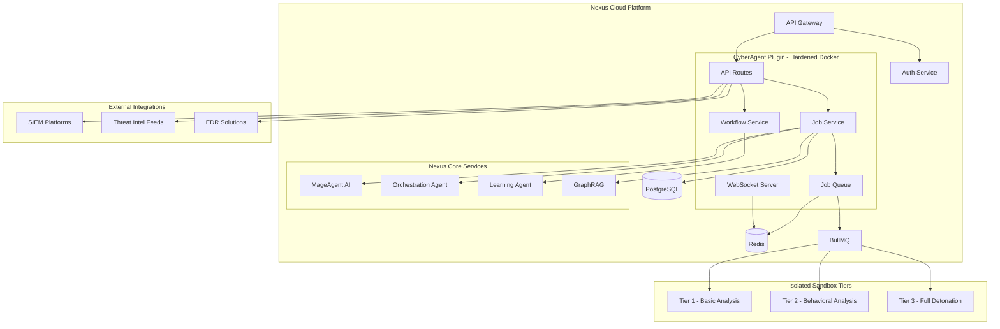

---

## Core Components

### API Gateway and Routing

The CyberAgent API provides RESTful endpoints for all security operations with comprehensive middleware for authentication, rate limiting, and usage tracking.

| Component | Responsibility | Technology |
|-----------|----------------|------------|
| **Routes** | HTTP request handling and validation | Express.js |
| **Authentication** | JWT validation and RBAC | Custom middleware |
| **Rate Limiter** | DoS protection and quota enforcement | Redis + Token bucket |
| **Usage Tracking** | Billing metering and analytics | Custom middleware |
| **Error Handler** | Standardized error responses | Express middleware |

**API Architecture:**

```typescript
interface APIConfig {
  version: 'v1';
  basePath: '/api/v1/cyberagent';
  endpoints: {
    scan: '/scan';
    threats: '/threats';
    incidents: '/incidents';
    compliance: '/compliance/:framework';
    jobs: '/jobs';
    workflows: '/workflows';
    malware: '/malware';
    exploits: '/exploits';
    iocs: '/iocs';
    yara: '/yara';
  };
}
```

### Job Service and Queue System

The job service manages the complete lifecycle of security operations from creation through completion.

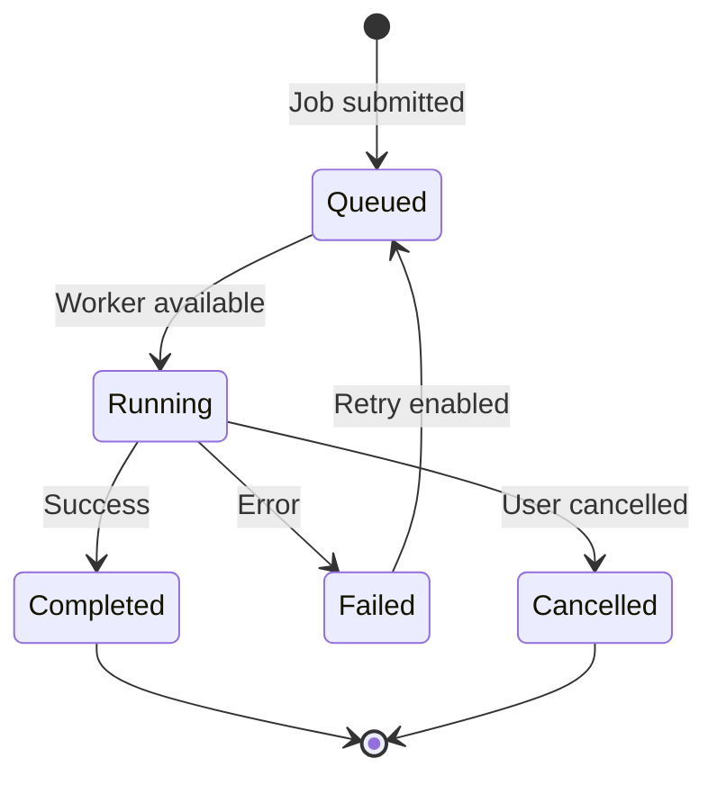

**Queue Architecture:**

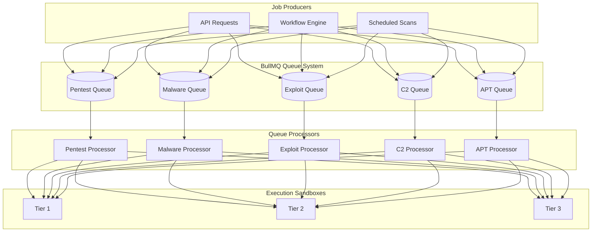

### Workflow Engine

The workflow engine executes complex multi-step security operations with dependency management, conditions, and approvals.

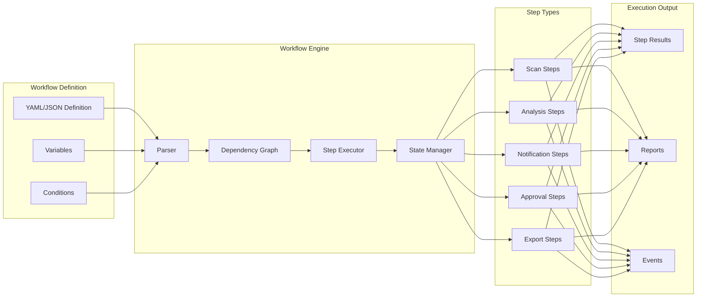

**Supported Workflow Step Types:**

| Step Type | Description | Configuration |
|-----------|-------------|---------------|
| `scan` | Execute security scan | scan_type, target, tools, config |
| `condition` | Conditional branching | conditions, on_true, on_false |
| `parallel` | Parallel step execution | steps[] |
| `loop` | Iterate over collection | items, step, max_iterations |
| `approval` | Manual approval gate | approvers, timeout, message |
| `notification` | Send alerts | channels, recipients, message |
| `nexus_analysis` | AI-powered analysis | analysis_type, input_step |
| `report` | Generate reports | report_type, format, include_steps |
| `export` | Export data | format, destination |

### Nexus Integration Framework

The Nexus Integration orchestrates comprehensive security analysis by integrating multiple AI services.

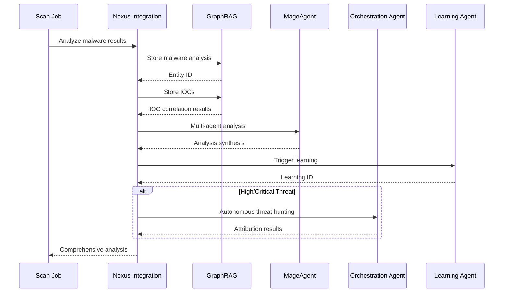

**Integration Services:**

| Service | Purpose | Capabilities |
|---------|---------|--------------|
| **GraphRAG** | Persistent knowledge graph | Threat intel storage, IOC correlation, pattern matching |
| **MageAgent** | Multi-agent AI analysis | Deep analysis, pattern recognition, synthesis |
| **Orchestration Agent** | Autonomous operations | Threat hunting, incident response, attribution |
| **Learning Agent** | Continuous improvement | Detection tuning, rule generation, model updates |

---

## Sandbox Architecture

CyberAgent employs a three-tier sandbox architecture for safe execution of security tools and malware analysis.

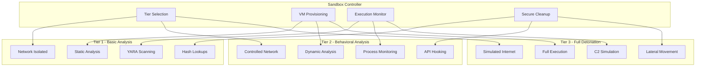

**Tier Characteristics:**

| Tier | Isolation Level | Network Access | Execution Mode | Use Cases |
|------|----------------|----------------|----------------|-----------|
| **Tier 1** | High | None | Static only | File hashing, YARA, basic analysis |
| **Tier 2** | Very High | Controlled | Monitored execution | Behavioral analysis, API monitoring |
| **Tier 3** | Maximum | Simulated | Full detonation | Advanced malware, C2 analysis |

---

## Data Flow

### Security Scan Pipeline

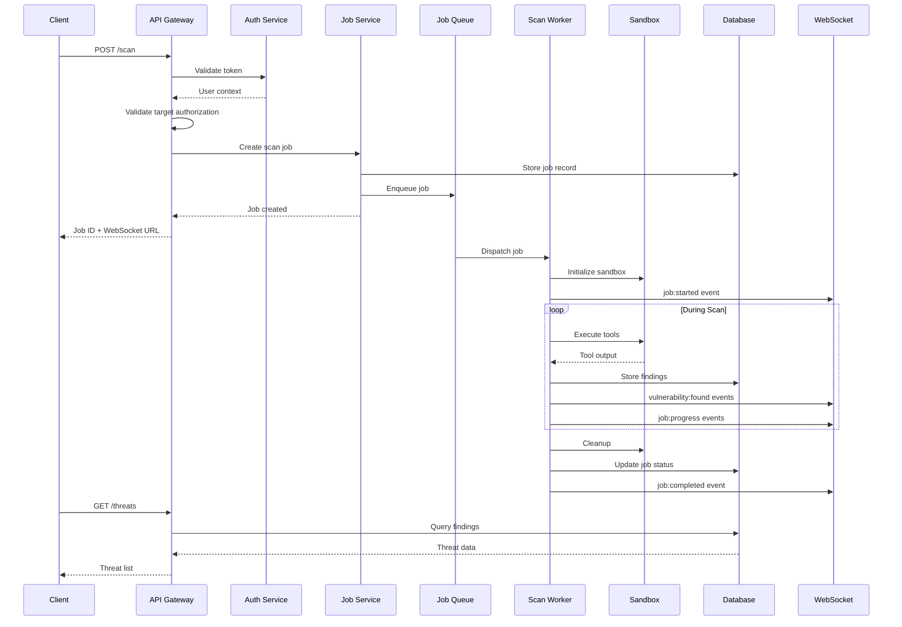

### Real-time Event Streaming

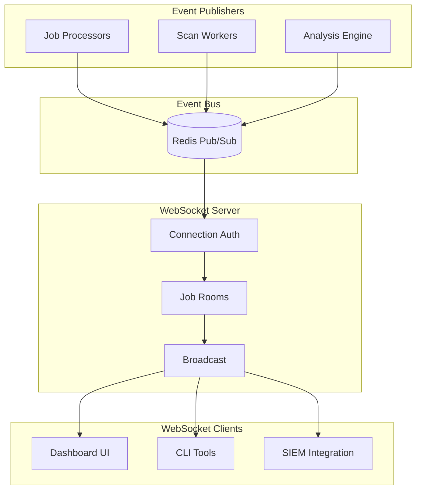

**WebSocket Event Types:**

```typescript
type WebSocketEventType =
  | 'job:created'
  | 'job:started'
  | 'job:progress'
  | 'job:completed'
  | 'job:failed'
  | 'job:cancelled'
  | 'tool:started'
  | 'tool:output'
  | 'tool:completed'
  | 'vulnerability:found'
  | 'malware:detected'
  | 'ioc:extracted'
  | 'exploit:success'
  | 'exploit:failed'
  | 'agent:spawned'
  | 'agent:thinking'
  | 'agent:action'
  | 'agent:completed'
  | 'workflow:phase_started'
  | 'workflow:phase_completed'
  | 'nexus:recall'
  | 'nexus:stored';
```

---

## Security Model

### Authentication and Authorization

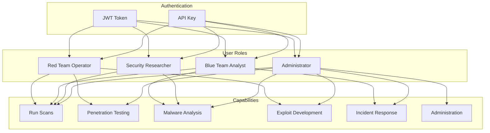

### Target Authorization

CyberAgent requires explicit authorization before scanning any target to prevent unauthorized testing.

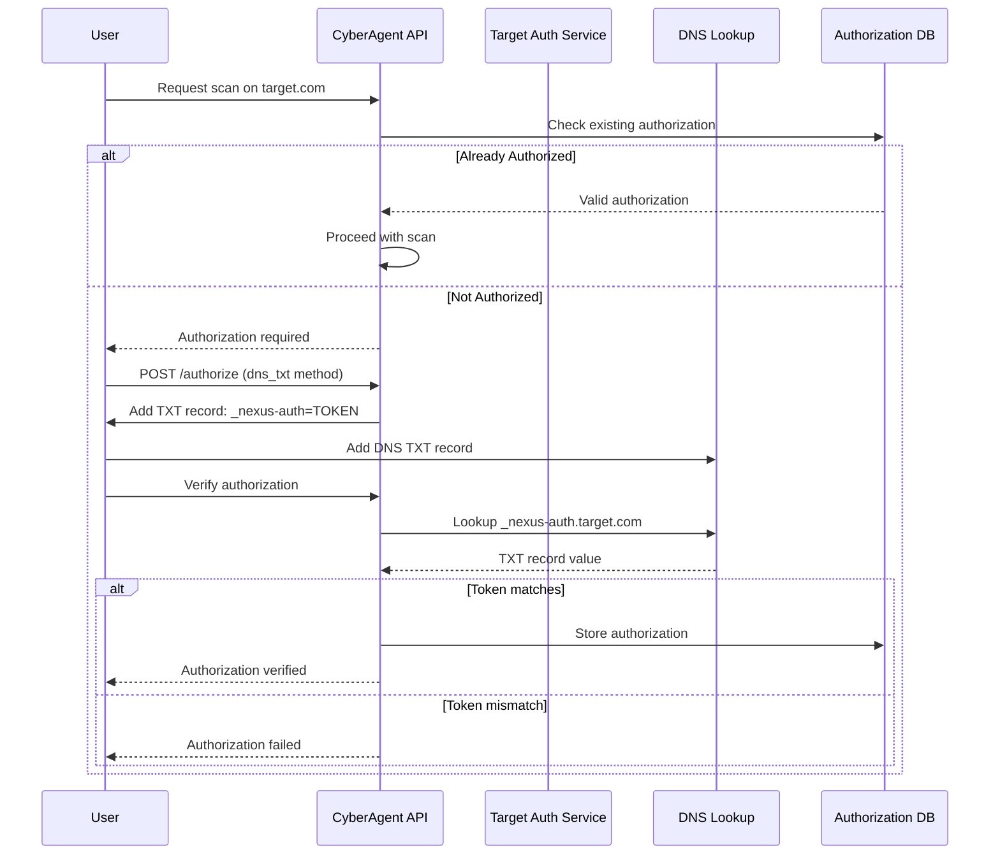

**Authorization Methods:**

| Method | Description | Verification |
|--------|-------------|--------------|
| `dns_txt` | DNS TXT record verification | Automatic DNS lookup |
| `file_upload` | Upload authorization document | Manual review |
| `manual` | Administrator approval | Manual verification |

### Audit Logging

All security operations are logged to an immutable audit trail.

```typescript
interface AuditLogEntry {
  timestamp: Date;
  event_type: string;
  user_id: string;
  org_id: string;
  resource_type: string;
  resource_id: string;
  action: string;
  ip_address: string;
  user_agent: string;
  request_id: string;
  details: Record<string, any>;
  result: 'success' | 'failure';
  error_message?: string;
}
```

---

## API Reference

### Base URL

```
https://api.adverant.ai/proxy/nexus-cyberagent/api/v1
```

### Scan Endpoints

| Method | Path | Description |
|--------|------|-------------|
| `POST` | `/scan` | Run security scan |
| `GET` | `/scan/:scanId` | Get scan status |
| `DELETE` | `/scan/:scanId` | Cancel scan |

### Threat Endpoints

| Method | Path | Description |
|--------|------|-------------|
| `GET` | `/threats` | List detected threats |
| `GET` | `/threats/:threatId` | Get threat details |
| `PUT` | `/threats/:threatId` | Update threat status |

### Incident Endpoints

| Method | Path | Description |
|--------|------|-------------|
| `POST` | `/incidents` | Create incident report |
| `GET` | `/incidents` | List incidents |
| `GET` | `/incidents/:incidentId` | Get incident details |
| `PUT` | `/incidents/:incidentId` | Update incident |

### Compliance Endpoints

| Method | Path | Description |
|--------|------|-------------|
| `GET` | `/compliance/:framework` | Get compliance status |
| `POST` | `/compliance/assess` | Run compliance assessment |
| `GET` | `/compliance/evidence` | Get evidence package |

### Malware Analysis Endpoints

| Method | Path | Description |
|--------|------|-------------|
| `POST` | `/malware/upload` | Upload sample |
| `GET` | `/malware/:sampleId` | Get analysis results |
| `GET` | `/malware/:sampleId/iocs` | Get extracted IOCs |

### Workflow Endpoints

| Method | Path | Description |
|--------|------|-------------|
| `POST` | `/workflows/execute` | Execute workflow |
| `GET` | `/workflows/:executionId` | Get execution status |
| `POST` | `/workflows/:executionId/approve` | Approve pending step |

---

## Database Schema

### Core Tables

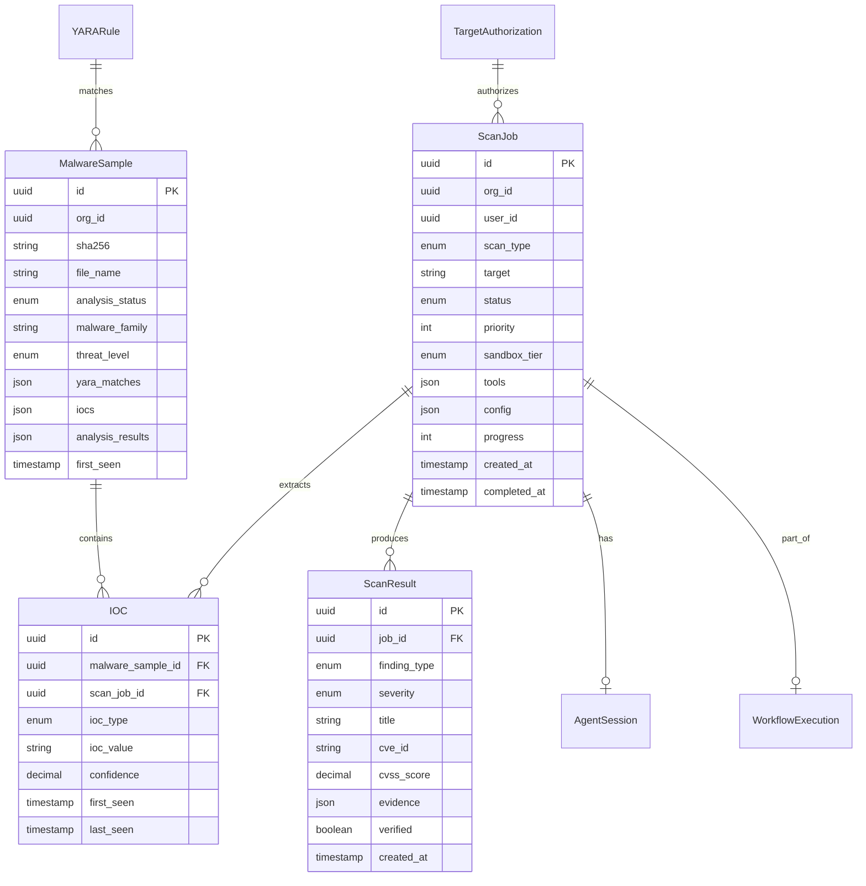

---

## Scaling Characteristics

### Horizontal Scaling

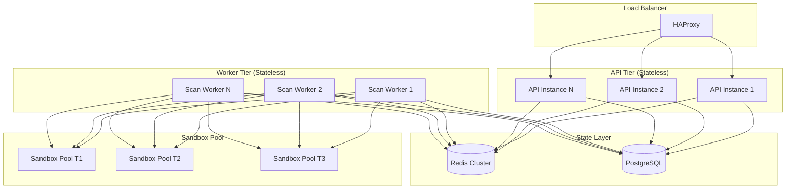

### Performance Benchmarks

| Metric | Single Node | Cluster (3 nodes) | Target |
|--------|-------------|-------------------|--------|
| API Requests/sec | 2,000 | 6,000 | 10,000 |
| Concurrent Scans | 10 | 50 | 100 |
| Malware Analysis/hr | 50 | 200 | 500 |
| WebSocket Connections | 1,000 | 5,000 | 10,000 |
| IOC Correlation Latency | 100ms p95 | 150ms p95 | <200ms |

### Resource Requirements

| Tier | vCPU | Memory | Storage | Endpoints |
|------|------|--------|---------|-----------|
| **Starter** | 4 | 8 GB | 50 GB | Up to 50 |
| **Professional** | 8 | 16 GB | 200 GB | Up to 500 |
| **Enterprise** | 16+ | 32+ GB | 1+ TB | Unlimited |

---

## Integration Points

### SIEM Integration

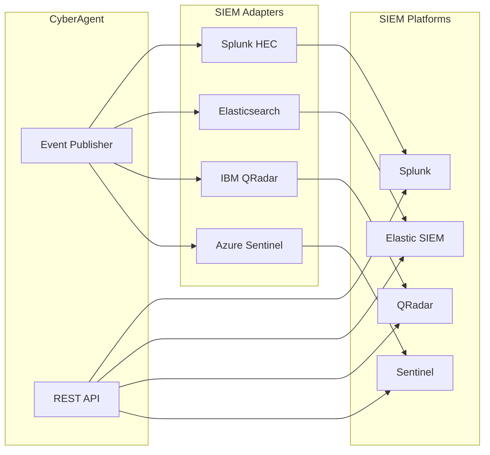

### Threat Intelligence Feeds

| Feed Type | Integration | Update Frequency |
|-----------|-------------|------------------|
| **MISP** | REST API | Real-time |
| **STIX/TAXII** | TAXII Client | Hourly |
| **VirusTotal** | API | On-demand |
| **AlienVault OTX** | API | Hourly |
| **Custom Feeds** | Webhook ingestion | Configurable |

### Webhook Events

```typescript
interface WebhookConfig {
  url: string;
  events: WebhookEvent[];
  secret: string;
  retryPolicy: {
    maxRetries: number;
    backoffMs: number;
  };
}

type WebhookEvent =
  | 'scan.started'
  | 'scan.completed'
  | 'scan.failed'
  | 'vulnerability.critical'
  | 'vulnerability.high'
  | 'malware.detected'
  | 'incident.created'
  | 'compliance.violation';
```

---

## Deployment Architecture

### Kubernetes Deployment

```yaml
apiVersion: apps/v1
kind: Deployment
metadata:
  name: nexus-cyberagent
  namespace: nexus-plugins
spec:
  replicas: 3
  selector:
    matchLabels:
      app: nexus-cyberagent
  template:
    metadata:
      labels:
        app: nexus-cyberagent
    spec:
      securityContext:
        runAsNonRoot: true
        runAsUser: 1000
        fsGroup: 1000
      containers:
        - name: cyberagent
          image: adverant/nexus-cyberagent:1.0.0
          ports:
            - containerPort: 8080
          resources:
            requests:
              cpu: "2000m"
              memory: "4096Mi"
            limits:
              cpu: "4000m"
              memory: "8192Mi"
          securityContext:
            allowPrivilegeEscalation: false
            readOnlyRootFilesystem: true
            capabilities:
              drop:
                - ALL
          env:
            - name: NODE_ENV
              value: "production"
            - name: DATABASE_URL
              valueFrom:
                secretKeyRef:
                  name: cyberagent-secrets
                  key: database-url
          livenessProbe:
            httpGet:
              path: /health/live
              port: 8080
            initialDelaySeconds: 30
            periodSeconds: 10
          readinessProbe:
            httpGet:
              path: /health/ready
              port: 8080
            initialDelaySeconds: 5
            periodSeconds: 5
```

### Hardened Container Configuration

CyberAgent runs in `hardened_docker` execution mode with isolation level 3:

| Security Control | Configuration |
|------------------|---------------|
| **Network Isolation** | Dedicated network namespace |
| **Filesystem** | Read-only root, tmpfs for temp |
| **Capabilities** | All capabilities dropped |
| **Seccomp** | Custom restrictive profile |
| **AppArmor** | Enforcing mode |
| **Resource Limits** | CPU/Memory quotas enforced |

---

## Monitoring and Observability

### Metrics

| Metric | Type | Description |
|--------|------|-------------|
| `cyberagent_scans_total` | Counter | Total scans processed |
| `cyberagent_scan_duration_seconds` | Histogram | Scan execution duration |
| `cyberagent_vulnerabilities_total` | Counter | Vulnerabilities discovered |
| `cyberagent_malware_samples_total` | Counter | Malware samples analyzed |
| `cyberagent_queue_depth` | Gauge | Pending jobs in queue |
| `cyberagent_sandbox_utilization` | Gauge | Sandbox resource utilization |

### Health Checks

```bash
# Liveness - Is the service running?
GET /health/live

# Readiness - Can the service handle requests?
GET /health/ready

# Detailed health with service dependencies
GET /health
```

**Health Response:**

```json
{
  "status": "healthy",
  "timestamp": "2025-01-15T10:30:00Z",
  "version": "1.0.0",
  "services": {
    "database": { "status": "healthy", "latency": 5 },
    "redis": { "status": "healthy", "latency": 2 },
    "graphrag": { "status": "healthy", "latency": 15 },
    "mageagent": { "status": "healthy", "latency": 20 },
    "tier1_sandbox": { "status": "healthy" },
    "tier2_sandbox": { "status": "healthy" },
    "tier3_sandbox": { "status": "healthy" }
  },
  "uptime": 86400
}
```

---

## Further Reading

- **[Quick Start Guide](./QUICKSTART.md)**: Get started in 20 minutes
- **[Use Cases](./USE-CASES.md)**: Real-world implementation examples
- **[API Documentation](https://docs.adverant.ai/plugins/cyberagent/api)**: Complete API reference
- **[Security Guidelines](./docs/security/guidelines.md)**: Security best practices

---

**Questions?** Contact our security architecture team at security-architecture@adverant.ai
