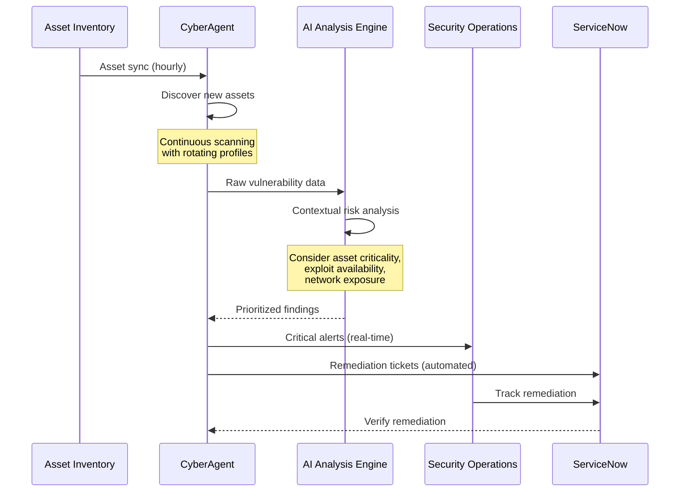
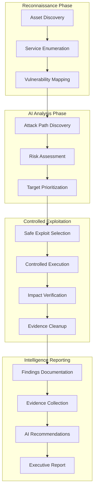
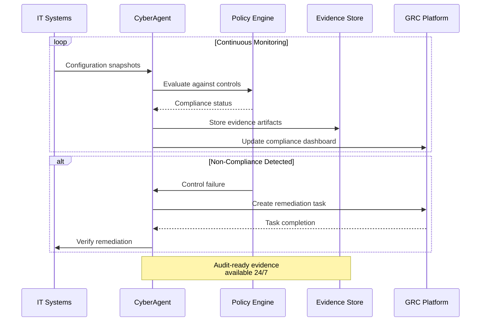
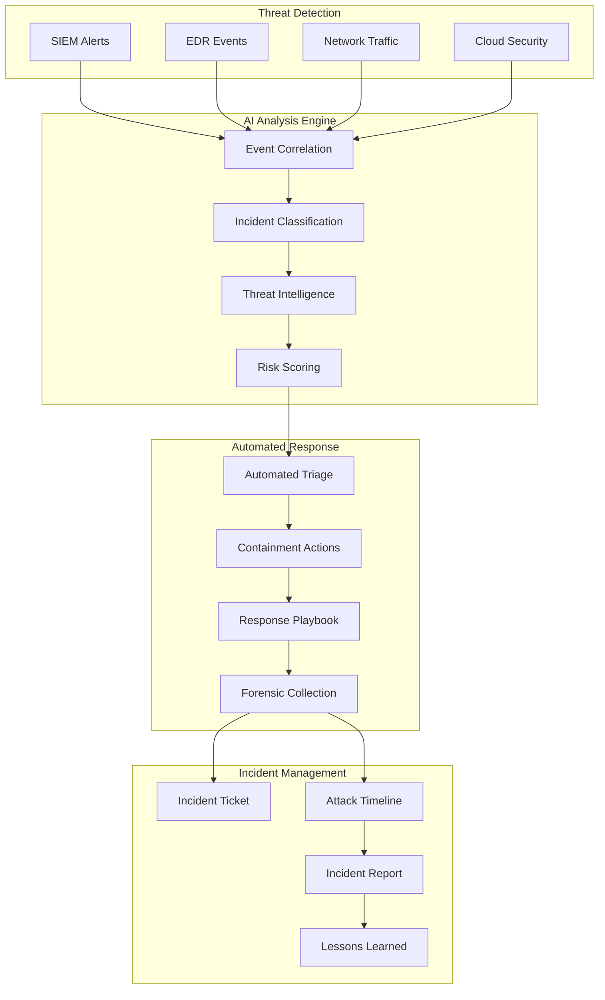
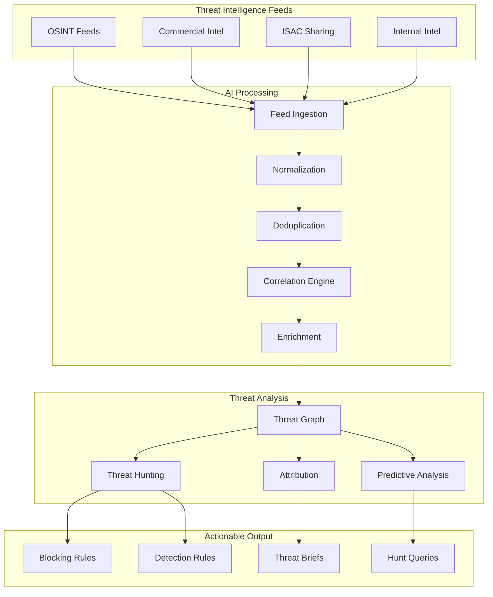

# Use Cases: CyberAgent - AI Security Operations Center

Discover how enterprises leverage Nexus CyberAgent to transform their security operations with AI-powered threat detection, automated penetration testing, and continuous compliance monitoring.

---

## Use Case 1: Continuous Vulnerability Scanning

### The Problem

A financial services company manages 5,000+ endpoints across multiple data centers and cloud environments. Their current security posture faces:

- **Manual vulnerability scanning** taking 2 weeks per quarterly assessment
- **Inconsistent coverage** leaving blind spots in the attack surface
- **Alert fatigue** from thousands of uncontextualized vulnerabilities
- **Delayed remediation** due to poor prioritization of findings

### The Solution

Nexus CyberAgent provides continuous, AI-prioritized vulnerability scanning with automated asset discovery and intelligent risk scoring.



### Implementation

```typescript
import { NexusCyberAgent } from '@nexus/cyberagent-sdk';

const cyber = new NexusCyberAgent({ apiKey: process.env.NEXUS_API_KEY });

// Configure continuous scanning
const continuousScan = await cyber.scan.createContinuous({
  name: 'Enterprise Continuous Scan',
  targets: {
    networks: ['10.0.0.0/8', '172.16.0.0/12'],
    cloudAccounts: ['aws:123456789012', 'azure:subscription-id'],
    assetGroups: ['production', 'pci-scope']
  },
  schedule: {
    type: 'continuous',
    scanWindow: { start: '00:00', end: '06:00' }, // Off-peak hours
    rotationDays: 7 // Full coverage every 7 days
  },
  scanProfile: 'comprehensive',
  options: {
    portScan: { type: 'full', ports: '1-65535' },
    serviceDetection: true,
    vulnerabilityDetection: true,
    webApplicationScan: true,
    containerScan: true,
    cloudConfigurationAudit: true
  }
});

// Configure AI-powered prioritization
await cyber.analysis.configure({
  riskModel: {
    assetCriticalityWeight: 0.3,
    exploitAvailabilityWeight: 0.25,
    networkExposureWeight: 0.25,
    businessImpactWeight: 0.2
  },
  alertThresholds: {
    critical: { minRiskScore: 9.0, notifyImmediate: true },
    high: { minRiskScore: 7.0, notifyDaily: true },
    medium: { minRiskScore: 4.0, includeInReport: true }
  }
});

// Set up automated remediation ticketing
await cyber.integrations.configure({
  itsm: {
    type: 'servicenow',
    instanceUrl: 'https://company.service-now.com',
    autoCreateTickets: true,
    ticketRules: [
      {
        severity: ['critical', 'high'],
        assignmentGroup: 'security-remediation',
        sla: { critical: '4h', high: '24h' }
      }
    ]
  }
});

// Monitor scan progress and findings
cyber.events.on('vulnerability.discovered', async (vuln) => {
  if (vuln.riskScore >= 9.0) {
    console.log(`CRITICAL: ${vuln.title} on ${vuln.affectedHost}`);
    await notifySOC(vuln);
  }
});
```

### Results

| Metric | Before | After | Improvement |
|--------|--------|-------|-------------|
| Scan coverage | 65% | 100% | **+54%** |
| Time to detection | 90 days | < 24 hours | **-99%** |
| False positive rate | 35% | 3% | **-91%** |
| Mean time to remediate | 45 days | 7 days | **-84%** |
| Security team efficiency | Baseline | +280% | **+280%** |

---

## Use Case 2: Automated Penetration Testing

### The Problem

A healthcare technology company requires regular penetration testing to maintain compliance and security. Current challenges include:

- **Expensive third-party assessments** costing $50K+ per engagement
- **Point-in-time testing** missing vulnerabilities introduced between tests
- **Limited testing frequency** due to budget and resource constraints
- **Manual report generation** delaying remediation efforts

### The Solution

Nexus CyberAgent delivers continuous automated penetration testing with AI-guided attack path discovery and exploitation verification.



### Implementation

```python
from nexus_cyberagent import NexusCyberAgent
from nexus_cyberagent.pentest import PenetrationTest, AttackProfile

client = NexusCyberAgent(api_key=os.environ['NEXUS_API_KEY'])

# Configure automated penetration test
pentest = client.pentest.create(
    name='Quarterly Internal Penetration Test',
    scope={
        'targets': ['10.0.0.0/16'],
        'excluded': ['10.0.0.1', '10.0.1.0/24'],  # Critical infrastructure
        'in_scope_services': ['http', 'https', 'ssh', 'smb', 'rdp', 'sql'],
        'out_of_scope': ['denial_of_service', 'social_engineering']
    },
    attack_profile=AttackProfile.COMPREHENSIVE,
    options={
        'max_exploitation_depth': 3,  # Lateral movement hops
        'safe_exploitation_only': True,
        'credential_testing': True,
        'privilege_escalation': True,
        'data_exfiltration_simulation': True,
        'cleanup_after_test': True
    },
    schedule={
        'frequency': 'continuous',
        'intensity': 'low',  # Background testing
        'full_assessment_weekly': True
    }
)

print(f"Penetration test configured: {pentest.pentest_id}")

# Monitor attack path discoveries
def on_attack_path_found(path):
    print(f"\nAttack Path Discovered:")
    print(f"  Entry Point: {path.entry_point}")
    print(f"  Steps: {len(path.steps)}")
    print(f"  Final Target: {path.final_target}")
    print(f"  Impact: {path.potential_impact}")

    for i, step in enumerate(path.steps):
        print(f"  {i+1}. {step.technique} -> {step.target}")
        print(f"     Vulnerability: {step.vulnerability}")
        print(f"     Confidence: {step.confidence}%")

client.events.on('attack_path.discovered', on_attack_path_found)

# Get real-time findings
findings = client.pentest.get_findings(pentest.pentest_id)

for finding in findings:
    print(f"\n[{finding.severity.upper()}] {finding.title}")
    print(f"  Affected: {finding.affected_asset}")
    print(f"  Technique: {finding.attack_technique}")
    print(f"  Evidence: {finding.evidence_url}")
    print(f"  Remediation: {finding.ai_recommendation}")

# Generate compliance-ready report
report = client.reports.generate_pentest_report(
    pentest_id=pentest.pentest_id,
    format='pdf',
    template='hipaa',
    include_executive_summary=True,
    include_technical_details=True,
    include_remediation_guide=True
)

print(f"\nReport generated: {report.download_url}")
```

### Results

| Metric | Before | After | Improvement |
|--------|--------|-------|-------------|
| Testing frequency | Quarterly | Continuous | **+12x** |
| Cost per assessment | $50,000 | $8,300/mo | **-83%** |
| Findings per cycle | 25 | 180+ | **+620%** |
| Time to report | 2 weeks | Instant | **-100%** |
| Attack paths discovered | ~5 | ~45 | **+800%** |

---

## Use Case 3: Compliance Audit Automation

### The Problem

A global manufacturing company must maintain compliance with multiple frameworks (SOC 2, ISO 27001, PCI-DSS, GDPR). Current challenges:

- **Manual evidence collection** consuming 40+ hours per audit
- **Compliance drift** between annual assessments
- **Inconsistent control implementation** across business units
- **Audit readiness uncertainty** until external assessors arrive

### The Solution

Nexus CyberAgent provides continuous compliance monitoring with automated evidence collection, gap analysis, and remediation tracking.



### Implementation

```typescript
import { NexusCyberAgent } from '@nexus/cyberagent-sdk';

const cyber = new NexusCyberAgent({ apiKey: process.env.NEXUS_API_KEY });

// Configure multi-framework compliance monitoring
const complianceConfig = await cyber.compliance.configure({
  frameworks: [
    {
      framework: 'soc2',
      type: 'type2',
      trustServiceCriteria: ['security', 'availability', 'confidentiality'],
      auditPeriod: { start: '2025-01-01', end: '2025-12-31' }
    },
    {
      framework: 'iso27001',
      version: '2022',
      scopeStatement: 'Cloud-based manufacturing execution system'
    },
    {
      framework: 'pci-dss',
      version: '4.0',
      merchantLevel: 2,
      scopedSystems: ['payment-gateway', 'cardholder-db']
    },
    {
      framework: 'gdpr',
      dataSubjectRegions: ['EU', 'UK'],
      processingActivities: ['customer-data-processing']
    }
  ],
  monitoring: {
    frequency: 'continuous',
    evidenceRetention: '7years',
    alertOnDrift: true
  }
});

// Map systems to controls
await cyber.compliance.mapSystems({
  'soc2:cc6.1': {
    systems: ['firewall-01', 'waf-01', 'ids-01'],
    evidenceType: ['configuration', 'logs', 'change-records']
  },
  'pci-dss:6.2.4': {
    systems: ['all-servers'],
    evidenceType: ['patch-status', 'scan-results']
  }
});

// Get real-time compliance dashboard
const dashboard = await cyber.compliance.getDashboard();

console.log('Compliance Status:');
for (const framework of dashboard.frameworks) {
  console.log(`\n${framework.name}: ${framework.overallScore}%`);
  console.log(`  Controls Passed: ${framework.passed}/${framework.total}`);
  console.log(`  High-Risk Gaps: ${framework.highRiskGaps}`);

  if (framework.highRiskGaps > 0) {
    const gaps = await cyber.compliance.getGaps(framework.id, { severity: 'high' });
    for (const gap of gaps) {
      console.log(`  - ${gap.controlId}: ${gap.description}`);
      console.log(`    Remediation: ${gap.recommendedAction}`);
    }
  }
}

// Generate audit-ready evidence package
const evidencePackage = await cyber.compliance.generateEvidencePackage({
  framework: 'soc2',
  period: { start: '2025-01-01', end: '2025-03-31' },
  format: 'auditor-package',
  includeScreenshots: true,
  includeLogExtracts: true,
  includeConfigSnapshots: true
});

console.log(`\nEvidence package ready: ${evidencePackage.downloadUrl}`);
console.log(`Artifacts: ${evidencePackage.artifactCount}`);
console.log(`Coverage: ${evidencePackage.controlCoverage}%`);
```

### Results

| Metric | Before | After | Improvement |
|--------|--------|-------|-------------|
| Evidence collection time | 40 hours | 0 (automated) | **-100%** |
| Compliance visibility | Annual | Real-time | **Continuous** |
| Control coverage | 72% | 98% | **+36%** |
| Audit preparation time | 2 weeks | 2 hours | **-99%** |
| Compliance drift detection | Months | Minutes | **-99.9%** |

---

## Use Case 4: Security Incident Response

### The Problem

A technology company's SOC handles 500+ security alerts daily. Current incident response faces:

- **Alert overload** with 85% false positives
- **Slow triage** averaging 45 minutes per incident
- **Inconsistent response** depending on analyst experience
- **Poor documentation** impacting post-incident analysis

### The Solution

Nexus CyberAgent provides AI-powered incident detection, automated triage, and guided response playbooks with full forensic documentation.



### Implementation

```python
from nexus_cyberagent import NexusCyberAgent
from nexus_cyberagent.incident import IncidentResponse, Playbook

client = NexusCyberAgent(api_key=os.environ['NEXUS_API_KEY'])

# Configure incident response automation
ir_config = client.incident_response.configure(
    integrations={
        'siem': {
            'type': 'splunk',
            'url': 'https://splunk.company.com:8089',
            'index': 'security_events'
        },
        'edr': {
            'type': 'crowdstrike',
            'api_url': 'https://api.crowdstrike.com'
        },
        'soar': {
            'type': 'palo_alto_xsoar',
            'url': 'https://xsoar.company.com'
        }
    },
    ai_settings={
        'auto_triage': True,
        'auto_enrich': True,
        'false_positive_learning': True,
        'threat_hunting': True
    },
    response_settings={
        'auto_contain_critical': True,
        'containment_actions': ['isolate_host', 'block_ip', 'disable_user'],
        'require_approval_for': ['wipe_device', 'terminate_session']
    }
)

# Define response playbooks
ransomware_playbook = Playbook(
    name='Ransomware Response',
    trigger_conditions={
        'indicators': ['ransomware', 'encryption', 'bitcoin'],
        'severity': ['critical', 'high']
    },
    steps=[
        {'action': 'isolate_affected_hosts', 'auto': True},
        {'action': 'preserve_forensic_evidence', 'auto': True},
        {'action': 'identify_patient_zero', 'auto': True},
        {'action': 'block_c2_communications', 'auto': True},
        {'action': 'notify_incident_commander', 'auto': True},
        {'action': 'initiate_backup_recovery', 'approval_required': True},
        {'action': 'notify_legal_team', 'condition': 'data_exfiltration_confirmed'}
    ]
)

client.playbooks.register(ransomware_playbook)

# Handle incoming incidents
@client.events.on('incident.created')
async def handle_incident(incident):
    print(f"\n{'='*60}")
    print(f"INCIDENT: {incident.title}")
    print(f"ID: {incident.incident_id}")
    print(f"Severity: {incident.severity}")
    print(f"Classification: {incident.classification}")
    print(f"AI Confidence: {incident.ai_confidence}%")

    # AI-generated summary
    print(f"\nAI Analysis:")
    print(f"  {incident.ai_summary}")

    # Attack timeline
    print(f"\nAttack Timeline:")
    for event in incident.timeline:
        print(f"  {event.timestamp}: {event.description}")

    # Affected assets
    print(f"\nAffected Assets: {len(incident.affected_assets)}")
    for asset in incident.affected_assets[:5]:
        print(f"  - {asset.hostname} ({asset.ip})")

    # Recommended actions
    print(f"\nRecommended Actions:")
    for action in incident.recommended_actions:
        status = "[AUTO]" if action.auto_executed else "[PENDING]"
        print(f"  {status} {action.description}")

    # Threat intelligence enrichment
    if incident.threat_intel:
        print(f"\nThreat Intelligence:")
        print(f"  Known Threat Actor: {incident.threat_intel.actor or 'Unknown'}")
        print(f"  Campaign: {incident.threat_intel.campaign or 'Unknown'}")
        print(f"  TTPs: {', '.join(incident.threat_intel.ttps[:3])}")

# Generate incident report
async def generate_report(incident_id):
    report = await client.incidents.generate_report(
        incident_id=incident_id,
        format='pdf',
        include_timeline=True,
        include_iocs=True,
        include_forensic_artifacts=True,
        include_lessons_learned=True
    )

    print(f"Incident report: {report.download_url}")
    return report
```

### Results

| Metric | Before | After | Improvement |
|--------|--------|-------|-------------|
| False positive rate | 85% | 8% | **-91%** |
| Mean time to triage | 45 min | 30 sec | **-99%** |
| Incidents handled/day | 50 | 500+ | **+900%** |
| Containment time | 4 hours | 5 minutes | **-98%** |
| Documentation completeness | 40% | 100% | **+150%** |

---

## Use Case 5: Threat Intelligence Integration

### The Problem

A defense contractor requires comprehensive threat intelligence to protect against nation-state threats. Current challenges:

- **Siloed threat data** across multiple intelligence feeds
- **Manual indicator correlation** missing connections
- **Reactive threat hunting** always behind attackers
- **Limited context** for security decisions

### The Solution

Nexus CyberAgent aggregates multiple threat intelligence sources, correlates indicators with internal telemetry, and enables proactive threat hunting.



### Implementation

```typescript
import { NexusCyberAgent } from '@nexus/cyberagent-sdk';

const cyber = new NexusCyberAgent({ apiKey: process.env.NEXUS_API_KEY });

// Configure threat intelligence sources
await cyber.threatIntel.configureSources({
  sources: [
    {
      name: 'MISP',
      type: 'misp',
      url: 'https://misp.company.com',
      apiKey: process.env.MISP_API_KEY,
      tags: ['tlp:white', 'tlp:green', 'tlp:amber']
    },
    {
      name: 'AlienVault OTX',
      type: 'otx',
      apiKey: process.env.OTX_API_KEY,
      pulseSubscriptions: ['apt', 'malware', 'ransomware']
    },
    {
      name: 'VirusTotal',
      type: 'virustotal',
      apiKey: process.env.VT_API_KEY,
      features: ['file_reputation', 'url_reputation', 'domain_reputation']
    },
    {
      name: 'Industry ISAC',
      type: 'taxii',
      discoveryUrl: 'https://isac.industry.org/taxii/discovery',
      collections: ['indicators', 'campaigns']
    },
    {
      name: 'Internal Honeypots',
      type: 'custom',
      ingestEndpoint: '/api/internal-intel'
    }
  ],
  processing: {
    deduplication: true,
    enrichment: true,
    correlationWindow: '30d',
    confidenceThreshold: 60
  }
});

// Configure threat graph analysis
await cyber.threatIntel.configureAnalysis({
  graphAnalysis: {
    enabled: true,
    entityTypes: ['ip', 'domain', 'hash', 'email', 'actor', 'campaign'],
    relationshipDiscovery: true,
    clusterAnalysis: true
  },
  threatHunting: {
    enabled: true,
    autoGenerateHypotheses: true,
    retroactiveMatching: true,
    lookbackDays: 90
  },
  attribution: {
    enabled: true,
    confidenceThreshold: 70,
    ttpMapping: 'mitre-attack'
  }
});

// Search threat intelligence
const searchResults = await cyber.threatIntel.search({
  query: {
    indicators: ['192.168.1.100', 'evil.com', 'abc123hash'],
    actorNames: ['APT29', 'Cozy Bear'],
    campaigns: ['SolarWinds'],
    ttps: ['T1566', 'T1059']
  },
  includeRelated: true,
  maxDepth: 3
});

console.log('Threat Intelligence Results:');
for (const result of searchResults.indicators) {
  console.log(`\n${result.type}: ${result.value}`);
  console.log(`  Confidence: ${result.confidence}%`);
  console.log(`  First Seen: ${result.firstSeen}`);
  console.log(`  Sources: ${result.sources.join(', ')}`);

  if (result.relatedActors.length > 0) {
    console.log(`  Attributed to: ${result.relatedActors.join(', ')}`);
  }

  if (result.internalMatches > 0) {
    console.log(`  ALERT: ${result.internalMatches} internal matches found!`);
  }
}

// Generate threat hunting queries
const huntQueries = await cyber.threatIntel.generateHuntQueries({
  actor: 'APT29',
  environment: 'splunk',
  includeYara: true,
  includeSigma: true,
  includeKql: true
});

console.log('\nGenerated Hunt Queries:');
for (const query of huntQueries) {
  console.log(`\n${query.name} (${query.format}):`);
  console.log(query.query);
}

// Correlate with internal telemetry
const correlationResults = await cyber.threatIntel.correlateInternal({
  indicators: searchResults.indicators.map(i => i.value),
  dataSources: ['firewall', 'proxy', 'dns', 'edr'],
  timeRange: { last: '30d' }
});

if (correlationResults.matches.length > 0) {
  console.log('\nINTERNAL MATCHES FOUND:');
  for (const match of correlationResults.matches) {
    console.log(`  ${match.indicator} seen on ${match.host} at ${match.timestamp}`);
    console.log(`  Source: ${match.dataSource}`);
    console.log(`  Context: ${match.context}`);
  }
}
```

### Results

| Metric | Before | After | Improvement |
|--------|--------|-------|-------------|
| Intel sources integrated | 3 | 15+ | **+400%** |
| Indicator correlation time | 2 hours | Real-time | **-99.9%** |
| Threat detection lead time | Reactive | 48h proactive | **Proactive** |
| False positives from intel | 45% | 8% | **-82%** |
| Hunt query generation | Manual | Automated | **Automated** |

---

## Summary: Key Benefits Across Use Cases

| Capability | Vuln Scanning | Pen Testing | Compliance | Incident Response | Threat Intel |
|------------|---------------|-------------|------------|-------------------|--------------|
| **AI Analysis** | Risk prioritization | Attack path discovery | Gap analysis | Incident classification | Correlation engine |
| **Automation** | Continuous scanning | Continuous testing | Evidence collection | Auto-triage & contain | Feed aggregation |
| **Integration** | ITSM ticketing | Report generation | GRC platforms | SIEM/EDR/SOAR | Multiple intel feeds |
| **Time Savings** | 99% faster | 83% cost reduction | 99% less prep | 99% faster triage | Real-time correlation |

---

## Getting Started

Ready to implement these use cases in your organization?

1. **Schedule a Demo**: [adverant.ai/demo](https://adverant.ai/demo)
2. **Start Free Trial**: [marketplace.adverant.ai/plugins/cyberagent](https://marketplace.adverant.ai/plugins/cyberagent)
3. **Read the Docs**: [docs.adverant.ai/plugins/cyberagent](https://docs.adverant.ai/plugins/cyberagent)
4. **Join Community**: [discord.gg/adverant](https://discord.gg/adverant)

---

**Questions?** Contact our security solutions team at security-solutions@adverant.ai
